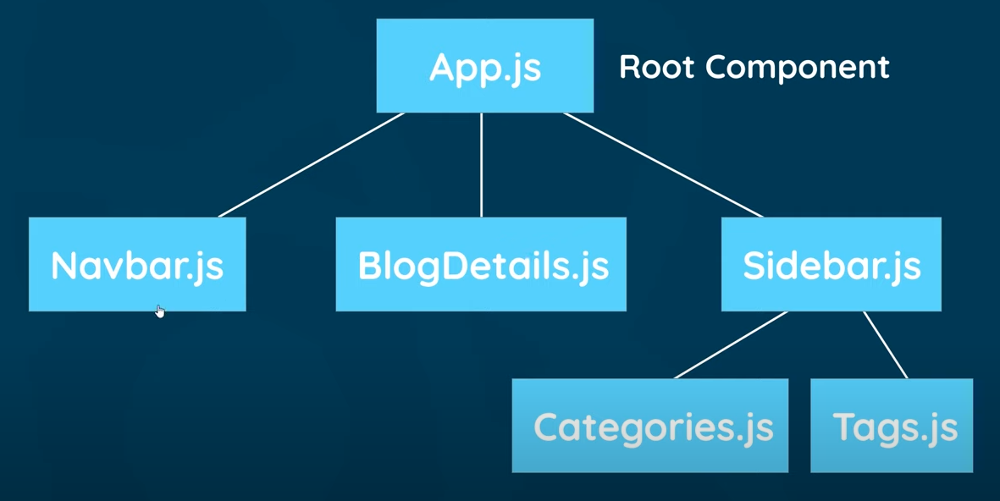
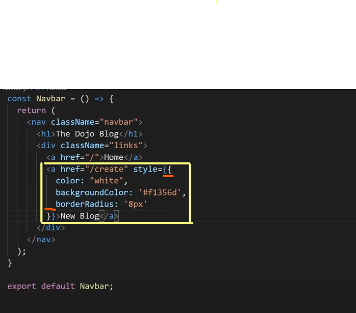

# JS-React-
Learning JS React

<!-- Notes -->

1. About all files in the package:

    1. Node Modules : It contains all the project dependencies including the react library.Any other package or library that we need to install later on is going here.

    2. Public : This is where all the files public to the browser live.
    
      * Note that it has an "index.html" file that is served to the browser. All the react code is injected to this "index.html" file and is served to the browser.

    3. src : all the react components live here (i.e. within the App.js, index.js etc.)

2. Components 

* The are the building blocks of react.
* A single page can contain several componenets i.e the navbar can be one, the article can be another and so on.

* Each component contains their own "template" and "logic"
   1. Template refers to the basic html structure of the component.
   2. Logic refers to any javascript code it can hold.

* The general template is provided by jsx which is very similar to html. In the background  the transpiler called "babel" converts jsx to html before rendering it to the browser.

* One of the major differences between jsx and html is that jsx uses "className" instead of "class".
This is because "class" is a reserved keyword in js and jsx template is rendered to the "App.js" file within the "src" folder.

3.  The function "App" in the "App.js" file is the component function.

  * A component is generally a function. 
  * It generally returns a jsx template.
  * Then at the bottom we export that component so that we can use it elsewhere like as we "import" the App component in the "index.js" file.

4. To add dynamic content such as a variable into the component :

 1. declare it within the component before the return statement 
 2. use the curly braces syntax 
 3. The curly braces will denote that the variable within it has to be displayed in the browser like we added within the <h1>{ title }</h1> here!
 4. This kind of output does not work for objects and booleans! They will show error!
 5. Instead of hoisting you can simply write the js code within the curly braces
 6. The arrays when output as such would be simply converted to a string with no commas or seperations.

 5. Component Tree 

 

 6. To make a new component, create a new file like "Navbar.js" with the "src" folder.

 7. How to add styles to components :

 

 * The first curly brace represents the dynamic value or the variable while the second one represents a js object.

* The css property and value are typed in the proper syntax within the object braces.

* Remember to camelcase css properties that are two words.

8. Points related to adding events :

 * remember the "no invoking" rule

 * "wrap in an anonymous function" rule in case parameter to be added.